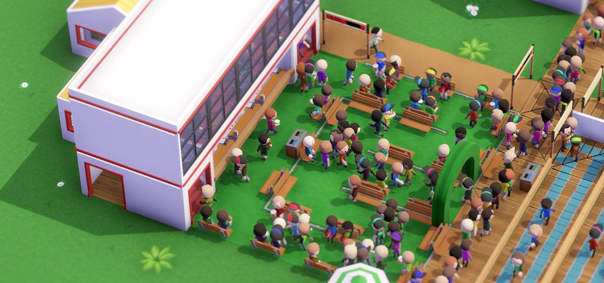
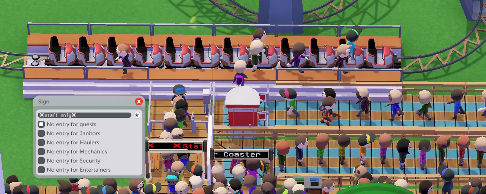
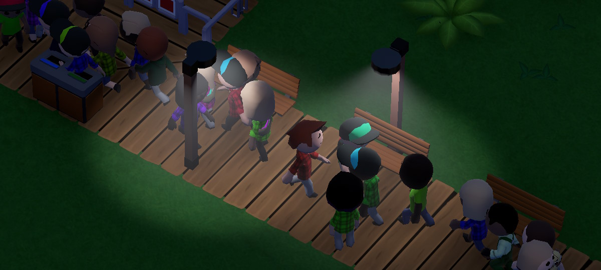
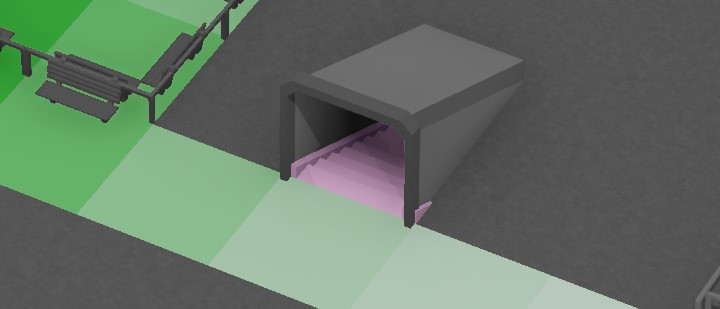
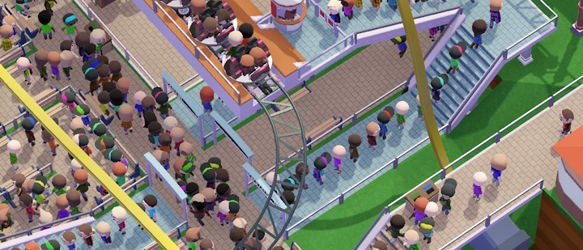

Paths work pretty much like you would expect, with one thing to note: if a guest is "wandering around", they will not turn back unless that's the only way to go (e.g. dead end), which makes 1-tile-wide paths useful for routing bored guests where you want them to be.

## Queues
Queues can be connected to ride entrances and allow guests to queue for a ride.

A single tile of queue fits 3 visitors and you might get an extra visitor at the end of the queue.

You'll generally want the queue line to be long enough to fit one batch of a visitors - so if a ride fits 20 guests, you'll want 7 tiles of queue. You can always have more, but be careful - if guests wait for too long in the queue, they might get bored and leave ("I hope X will be worth the long queue time!" means you're 3/4 of the way there).

Like many things in this game, maximum queuing time formally depends on a handful of factors (like guest's patience, ride's intensity relative to their preferences, or whether there's an entertainer cheering them on), but it's easier to not make your queues too long.

*Technical:* `Attraction.calculateMaxQueueingTime`

## Benches
Guests will look for a bench so it on when tired, and can leave the park if they don't find one.

Guests also like to take a seat when eating, which is a good excuse to build some sort of a seating area close to your shops.

Aside: holding Shift while placing path attachments places them at all available sides of a tile at once, which is convenient for benches.

## Signs
Signs allow you to control where people can and cannot go - be it guests or staff. They block specified groups from passing below them from their facing direction, which is great for one-directional paths.

For example, suppose you have a path leading from the ride exit back to the road. You don't want guests going in there - there's nothing to see. So you can place a sign and tick the "No entry for guests" checkbox.

## Trash Bins
Most types of food and drinks produce trash after being consumed (you can see a little trash bag icon next to the food type when selecting shops). The guests will carry the trash around and deposit it in a trash bin, or on the ground if they don't see any for a while.

There isn't much to note here except that the Large Trash Bin does, in fact, fit two times more trash than a regular one.

## Photo Spots
Have you seen "The scenery here is amazing!" in the Opinions tab of Park Info? Guests can think that once per 10 minutes or so, and positive thoughts are good for Experiences rating.

Usually the guests have a 10% chance to think that whenever arriving at a new tile with >65% decoration score and while having >65% Immersion, but Photo Spots make these easier to trigger, increasing the chance to 30% and lowering score thresholds to 32.5%.

In other words, it's good to have a couple of these in well-decorated spots of your park that people pass by.

## Lamps
Lamps are there to look cozy during nighttime (provided that you play with day/night cycle enabled, which affects nothing), but they take up space (where something useful could have been), so you might just make your own out of "regular" decorations. Here's a real lamp and a Wall Lamp on a Pillar:

## TVs
As far as I can tell (having inspected `Guest`, `QueueingBehaviour`, and references to `TV`), these don't do anything whatsoever and are purely decorative. But you might as well - there aren't any mission-critical path attachments that you can place on a side of a queue anyway.

## Employee paths
Guests don't like seeing these and you'll have to either builds walls around them or put pavillions over them, but also everything is forgiven the moment the path dips underground - this has no decoration effect on nearby paths, for example:

## Verticality
You can have paths go over other paths! And coasters be above or below the paths! And have paths go underground, or underwater, and generally overlap things as you please.

This can be handy on a few scenarios where space is limited, or to compress the park (but beware that a small park has more guests per square meter - see above).