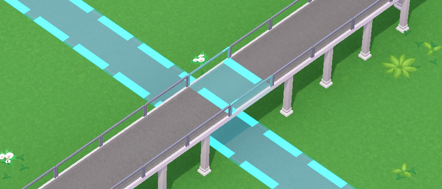

Don't forget that you can pick up and move your employees (by clicking on them and then clicking "pick up") if you need a puddle of vomit or a broken bench looked at quicker.

## Zones

Zones define where your employees will wander around when not occupied with a task. Zones can be arbitrarily-shaped, but do note: if you have this kind of thing

And the employee walks onto that single tile on the bridge after completing an assignment or walking back from a staff room, they will get stuck - you'll want to have a way to get off there (perhaps with a "no entry" sign from below and "no guests" sign from above) that's in the zone.

## Janitors
Janitors will clean up the messes that they stumble upon and the game will call the nearest available janitor to take out the trash or clean a shop/toilet.

As your park grows bigger, you'll want to assign some janitors to partol zones where the trash/messes is the most common (around shops and around rides with high nausea).

## Haulers
It is a good idea to assign your haulers to zones (stretching from the shops to the nearest Depot or Deliveries) so that they don't find themselves a kilometer away from the shop that has just ran out of stock.

## Mechanics
Mechanics will repair broken path attachments that they stumble upon and are otherwise called up when the time has come to do maintenance on a ride or it broke down.

## Security
Security Guards catch vandals if they see them breaking things, but also make the vandals less likely to appear in the first place. See "Events" section of this guide for explanation.

## Entertainers
Entertainers walk around and occasionally wave at guests, which counts towards positive experiences for them.

The exact impact of this is hard to measure, but also it's a low price to pay for "Oh no, a shark! 😄"