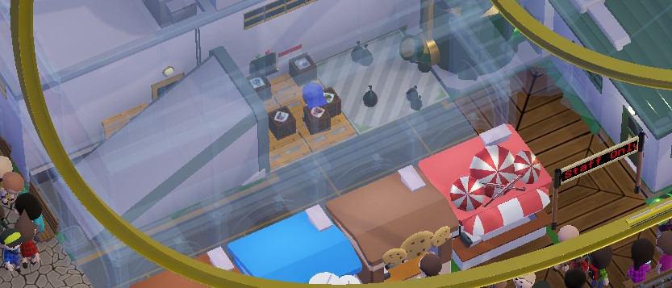
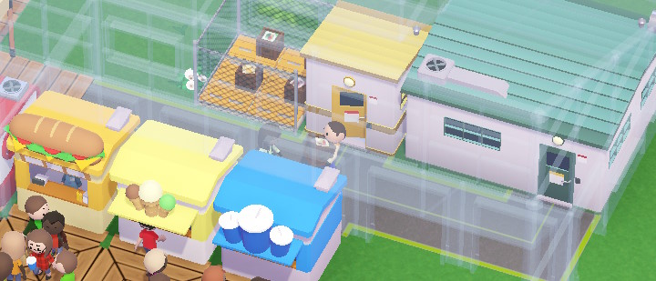

## Deliveries
Sometimes scenarios have the Deliveries building masked from the start,
and sometimes you'll have to do that yourself
(which can be a bit of an inconvenience since you can only build within the park, and Deliveries usually pokes out of the build area).

While you're there, you can also build a couple shops in front of Deliveries that will be quick to restock:  

## Depot
Essential for shops far away from the Deliveries - you wouldn't want your haulers to carry boxes across half the park, would you?  

## Staff Room
If you don't have one, employees will just sit on a bench wherever, and guests don't like seeing that (*No way, people work here?*).

## Trash Chute
It's like a depot, but only for dropping trash into it.

You don't need these very often because the trash comes from the food, and food comes from the shops, and your shops are probably close to a Deliveries or a Depot already (both of which accept trash).

## Staff Training Room
For most staff types, level affects stamina (how long they can go about before needing rest) and for janitors and mechanics it affects cleaning/maintenance speed, respectively.

In a big enough park it can be handy, but till then - don't worry about it.