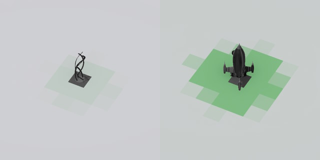
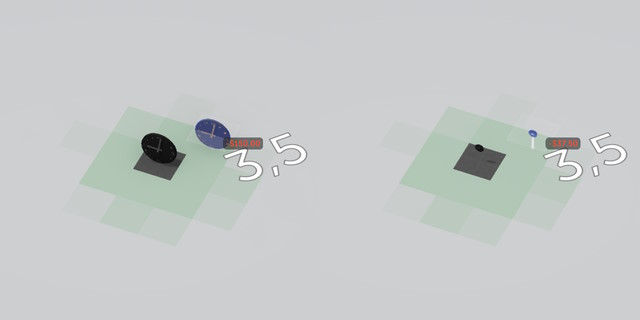
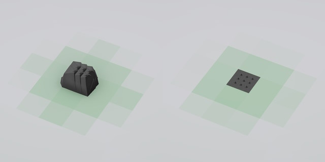
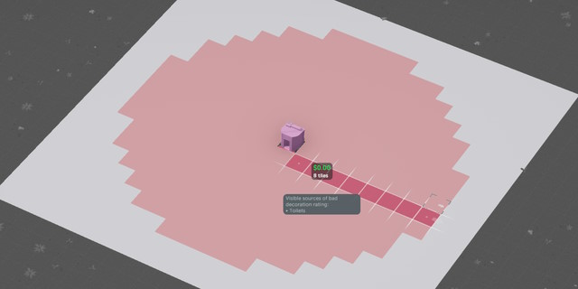

You can read the game's description of the stat by clicking on a guest, clicking Stats, and moving your mouse over the "Immersion" label. Here are the key points:

## Decoration bonuses are spread in a small range

Amount *usually* depends on the cost of a decoration, with more expensive decorations granting more decoration rating (shown: $100 statue vs $250 rocket).

## However, the amount does *not* depend on the scale of decoration
A 1/4 scale clock is as good as a full-sized one:

## And 9 rocks at 1/10 scale are almost as good as regular ones:

This is great news if you're trying to boost decoration rating of good-looking yet inexpensive scenery (because you can just hide little clocks/rocks inside it) and bad news if you were hoping to impress the game with your mountain-building skills.

## Decoration penalties spread across 8-tile range

In other words, you are highly encouraged to cover up undesirable objects - more on this in the next section.

## Decoration affects ride excitement
For tracked rides (coasters, go-karts, log flumes, etc.) in particular, you can get 15 or so extra excitement by decorating both the ride and the queue accordingly (doesn't have to be maxed out, just fairly green). This directly translates to extra money that you can charge per ticket and is generally encouraged. 

"Flat" rides also benefit from decoration, but not as much.