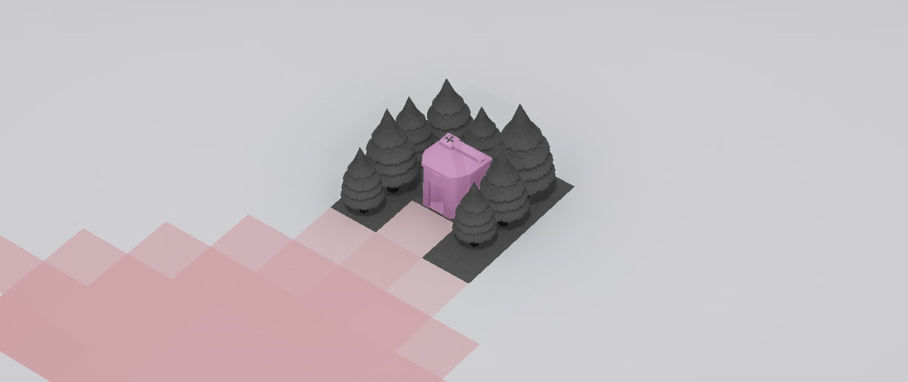
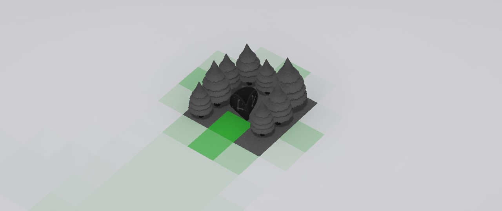
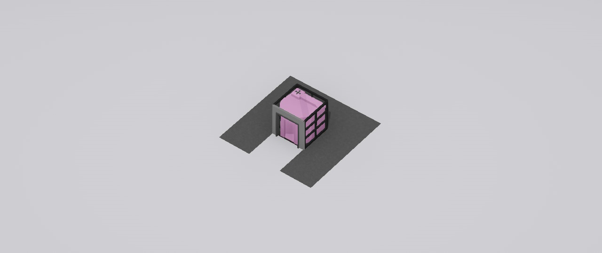
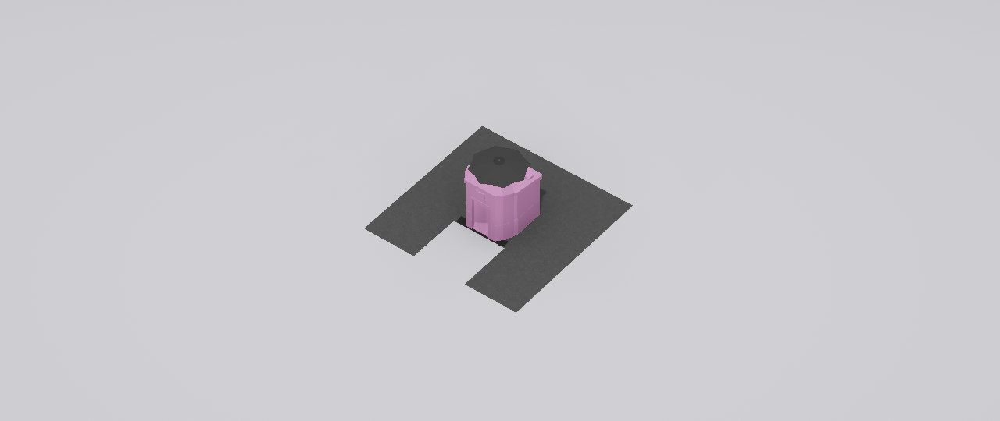

Experiment with different decorations and watch the Decoration overlay in Visualizers (enable after opening the Views panel on the left) to see what works and how. Here are some notes:

## Decorations block line of sight

## This also applies to positive bonuses

(in other words, be careful with building a cool castle around your ride)

## Some things block LOS even if you didn't expect it

A doorway and windows around the toilet render it invisible to a naked eye.

## Some things block LOS for technical reasons

*Perfectly camouflaged*

Visibility calculations appear to be based around bounding boxes, which means that things like umbrellas or pavilions more or less act as a 1x1x1 tile block.