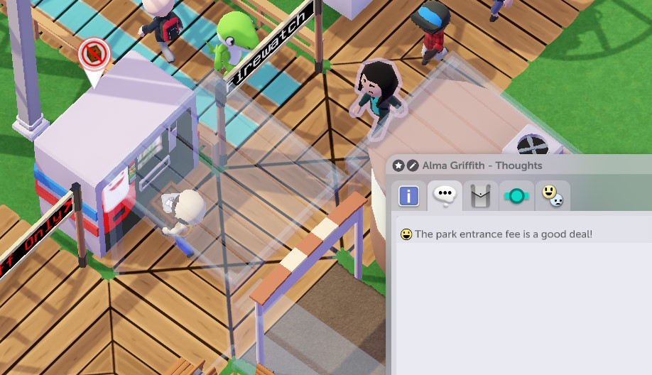

General notes:
- If you place a shop next to a road that an entrance can be reached from, a shopkeeper will enter the park through an entrance, but if you don't, they'll appear in the shop immediately.
- Some items make trash, some don't - for example, pizza needs more ingredients, but leaves no trash. You can tell by the little icon next to the food item.
- Assuming default park entrance fee, you can make shop items *a little* more expensive if you want to squeeze more money out the guests, but generally you don't have to.
- Exception to above rule, guests are willing to buy even fairly expensive umbrellas when it's raining.

## Info kiosk
If a guest has a map, they might open the map and look at where they need to go instead of wandering around aimlessly. It's a good idea to have a kiosk at the park entrance and then a couple more around the park if it's big enough.

## Cash machine
If a guest runs out of the money, they will generally start walking home, *but*: if there's a cash machine, they might get some money out of it and stay for a little bit more.

A guest is allowed to spend between 140 and 280 currency units total, depending on their generosity (technical: `Person.getMoneyLimit`).

## Toilets
Guests will not pee themselves too easily, but still it's good to have a toilet once in a while - especially since this means that each individual toilet will have to be cleaned less often, on average.

## Vending Machine
A little different from the rest of the shops in that:

1. It is loaded from the front, meaning that the guests get to see your haulers carrying boxes and be upset about that.
2. You never have to clean it.

The number of visitors that'll get to be upset about boxes can be greatly reduced by hiding the tile before the vending machine under a pavilion or a little structure:  

## Custom shops
These can act like any shop that you have access to, but are much smaller, making them a great choice if you're going to make your own building around the shop and won't want parts of the original design poking out.

## First Aid Room
Occasionally you'll get access to these. If a guest is about to throw up (running around while covering their mouth with their hands) but makes it to the First Aid Room, you won't have to clean up after them. Unfortunately, the guests are kind of bad at it - even if you have a First Aid Room right in front of a ride's exit, the guests still might throw up on the ground.