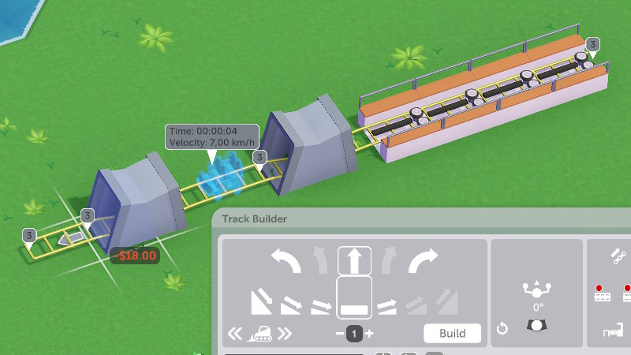

**Key takeaway:** an exciting ride should do most of the things that its kind can do - if it can do inversions, have a loop or two; if it can go fast, have it go fast at some point; if it can do sharp turns, have a couple of those. Descriptions of rides usually hint at what the game expects you to do.

~~The actual [boring math](https://parkitect.fandom.com/wiki/Coaster%5FStat%5FCalculation%5FGuide#Intrinsic%5FExcitement) (warning: fandom dot com) behind calculations involves numerous rules and graphs.~~

**Update:** if you'd like a more convenient exploration of ride metrics, I made a mod for it
([GitHub](https://github.com/YAL-Game-Things/Parkitect-Advanced-Tracked-Ride-Stats), [Steam workshop](https://steamcommunity.com/sharedfiles/filedetails/?id=3137101228)).

I'll summarize the important parts:

## Track Builder window
Note that:
1. Some rides have enough different parts on the right that a little scrollbar appears
2. Some parts have controls (like target velocity for brakes) that appear on the bottom of the window, and availability of these can vary by ride type.

## Excitement
Apart of depending on whether you're meeting expectations for the ride type, there are also some contributing factors:
-  **Decoration**  
	Per earlier, decoration rating of ride and/or queue can increase excitement.  
	You can view per-segment decoration ratings in the Graphs tab.  
	Maximum decoration contribution varies by ride type.
-  **Ride length**  
	Tracked rides that are less than 35 seconds long are penalized, so it's good to not make your rides *too* short.  
	Technically rides have optimal length that adds a little excitement, but the bonus is so small that it's usually not worth pursuing.  
-  **Intensity**  
	Rides with intensity above 90 are also penalized, though the effect is not noticeable unless you go way overboard with it.
-  **Underground transitions**  
	Dipping the track into the ground (counts so long as a tunnel frame appear on it) adds a little excitement (+7 for 1 dip, +12 for 2 dips, +15 for 3-4 dips).  
	Having more than 4 dips gradually diminishes this bonus, causing it to vanish completely at 8 dips.
-  **Cars per train**    
	You get +1 excitement for every car in a train (set in Settings tab), up to +5.  
	Having more cars per train is also good in general (more on this shortly).

*Technical:* `TrackedRideStats.calculateRatings`

## Intensity
Ride intensity is affected by:
-  **Maximum velocity**  
	(shown with Statistics tab open)
-  **Biggest drop height**  
	(also shown with Statistics tab open)
-  **Number of inversions**
-  **Maximum G-forces**  
	Max positive longitudinal G-force (acceleration) doesn't count, but max negative longitudinal G-force (deceleration) does, so trying to decrease intensity by adding brakes may not work like you think.

## Nausea
Nausea for tracked rides is affected by:
-  **Maximum G-forces**  
	(as in, picking the largest of 6)
-  **How long the visitors are subjected to lateral G-forces**  
	Roughly translates to "how many sharp turns do you have"
-  **Number of inversions**  
	Roughly +3 nausea per inversion, caps at +40.
-  **Number of drops**  
	+2 at 5 drops, +6 at 10 drops, and +10 at 15 drops - in other words, it's hard to mess up your coaster with drops.

## Pricing
Each visitor decides their perceived value for a ride based on a handful of factors
like its intensity relative to their preferences, generosity, or rain protection during a rain,
but overall you can set the ride entrance fees to 15-20% of their excitement
(so if a ride has 60 excitement, you can charge $12 for it) and no one will complain.
https://github.com/YAL-Game-Things/Parkitect-What-Is-Worth
*Technical:* `Attraction.calculateValueFor`

## Rain protection
A ride is considered to be officially rain-protected if 80% of its track has roofing over it.

Rain-protected rides will continue to operate during thunderstorms, which is convenient for certain scenarios.

Partial rain protection will still count for purposes of guests' interest during normal rain.

Don't beat yourself too hard over how this looks - most of the real-life "rain-protected" coasters sit inside a hangar of sorts.

## Cars per train
As the general rule, the more visitors your ride can fit at a time, the better.

For majority of rides, maximum number of cars per train depends on station count with a set maximum; some rides have multiple trains that are one car each (in which case maximum number of train-cars depends on ride length).

Also note that car count affects train physics, so you may need to run a test after changing it.

## On-ride cameras
Guests will buy on-ride photos 15-20% of the time if offered, which means that there's no harm in adding a couple cameras in exciting spots.

## Chainlifts
A lift will catch and pull a train so long as any train segment touches it, which means that you often only need one or two well-placed lift tiles to prevent a train from rolling back down the hill.

## Block brakes
These allow you to have more trains, which is advantageous for long rides and can be used to artificially increase ride length (by making visitors wait for the next track section to be cleared) on short rides.

## Stations
You can have more than one set of stations on a ride, which makes it more of a transport ride (the visitors will drop out on the station next after the one they've entered).

Having multiple stations causes ride stats to be unstable (as stats from the two segments interfere with each other).

## Auto-connect
To make it a little easier to build rides, the game is willing to auto-connect tracks within ±1 vertical unit (typically 1/4 of a tile) of destination altitude.

This can be used for several things:
- **Sharper slopes/drops**  
	
	For example, the steepest 2-tile flat↔flat transition that Wild Mouse usually allows is ±1 tile, but you can scale ±1.5 tiles this way.
- **"Speed bumps"**  
	Each counts as a drop.  
	  
	Add 3 flat tiles, then replace the first two by slope up + flat (flat tile will become a short drop)
- **Mini-drops**  
	Each counts as a drop and can be used to quickly add underground transitions.  
	  
	Add 3 flat tiles, then replace the first two by slope down + flat (flat tile will become a short slope up)  
	**Remark:** if the tunnel entrance is on the same or next track piece after the one with tunnel exit, the two may count as a single tunnel section - add one or more non-tunnel tile between such sections.
- **Sloped curves and half-helixes for rides that don't have them**  
	Good for compact builds, but also good for just building cool-looking water rides.
	  
	Take a turn away, slope up/down as necessary, and return to the original route. Then remove the detour and connect the curves.  
	When doing multiple sloped curves in a row, remove one slope at a time from a detour.

## Tweaking coasters
Closing a ride while the visitors are on it generally leaves them upset, so you can either:

- **Time it right**  
	Close the ride the moment the visitors start exiting the train and before the new visitors start getting on it (you can pause-unpause the game to time this better).  
	Surely enough, this only works if you have one train.
- **Physically block the entrance to the ride's queue**  
	The visitors will stop at nothing (not a "no entry" sign, not even a solid wall!) if they see a ride entrance, so you can remove the entry tile from the queue and replace it with a one that turns upwards/downwards so that it cannot connect to the road:
	  
	After there are no more visitors in the queue nor on the ride, it can be safely closed.