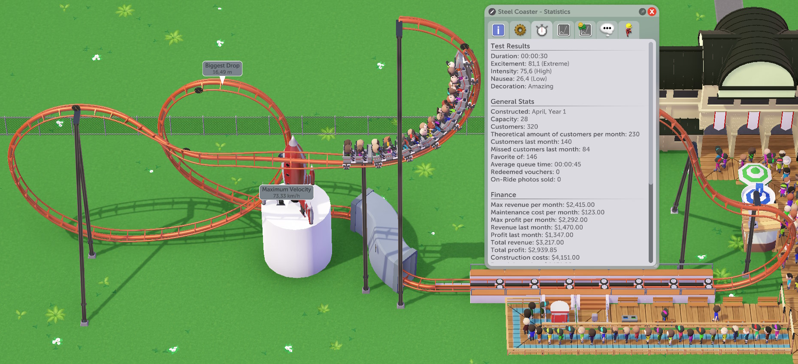
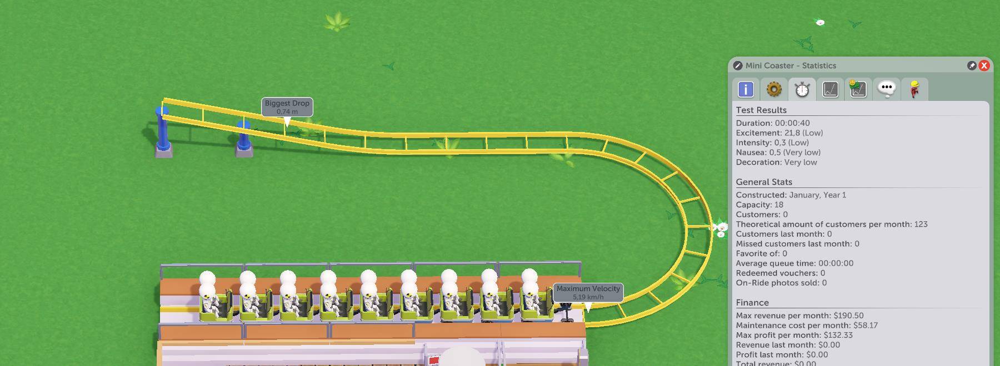
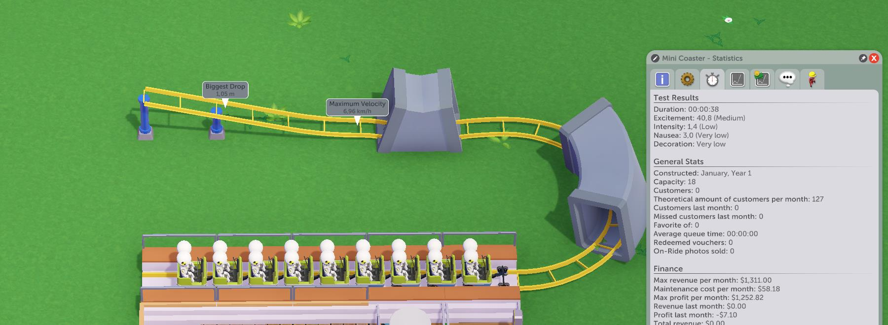
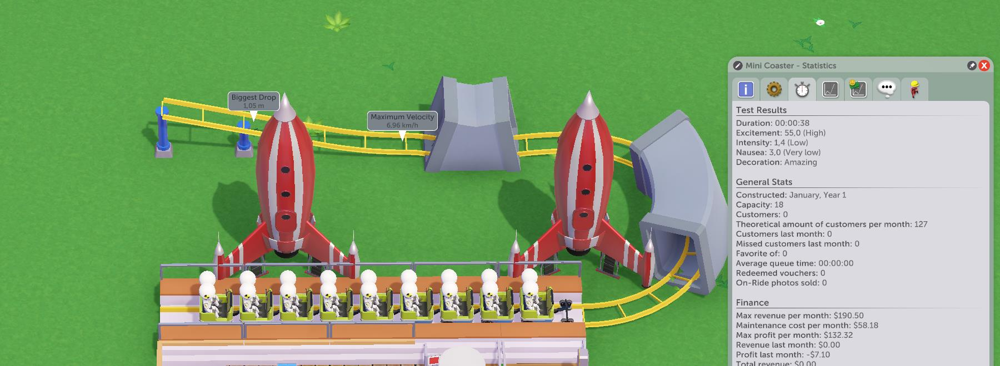

A coaster is complete if the train makes it back to the station. So why make a whole coaster when you could make half of it?

Here's the deal:

-  You cannot have chainlifts in a reversing coaster because they'll stop the train from going back.
-  You can have LSMs in a reversing coaster because they don't stop the train on the way back.
-  You cannot have multiple trains in a reversing coaster for obvious reasons.
-  This only works with "conventional" coasters - no "powered" rides like Log Flume or most of the "scenic rides".

This *mostly* limits you to coasters with LSM (more on this shortly) but results are outstanding.

Take this, for instance:  
  
Not a good coaster by most definitions - short, weirdly-shaped, and look at those "decorations"! *Anyway,*

With overall lack of features and duration it would usually have excitement of 35 or so, but instead it has 80, because every feature counts twice in a reversing coaster.

For coasters capable of both LSM and inversions, you can keep them amusingly compact if you want:
https://steamcommunity.com/sharedfiles/filedetails/?id=2914550685

## Flat reversing coaster
If you don't have LSM, what can you do? Not a whole lot - you only have your initial speed ("chainlift speed" in settings) so this mostly affords you to push the coaster over a little hill and have it do a few dips and turns before reversing and rolling back to the station.

But there's one ride that's quite remarkable for these machinations: the Mini Coaster. Cheap and small, Mini Coaster's standards are so low that even the bare minimum counts as adequate performance. Conveniently, bare minimum is exactly what we're going to do here.

Let's start with the general layout.  
  
Going at its initial speed of 5km/h, the ride lasts 40 seconds and has excitement rating of 21.8, which is arguably much more than it should have.

Noting the tips from earlier, let's add a couple tunnels - one by replacing two flat tiles by a dip down + auto-connect, and another by simply tilting the turn a little bit. Since this is a reversing coaster, each tunnel will count twice, bringing us to the optimal tunnel count.  
  
The excitement rating is now 40.8 - not only did we get +15 excitement from adding tunnels, but also increased peak velocity *somewhat*.

Finally, let's add some decorations. For the sake of this example, I'll just place two rockets and a fountain on the queue line.  
  
This brings the decoration level to Amazing and the ride now has excitement rating of 55.

A variation of this design called Boomerang For Cowards started as a joke between me and a friend, but quickly became a staple in our campaign parks as it turned out to be upsettingly profitable for its humble construction cost  
https://steamcommunity.com/sharedfiles/filedetails/?id=2914830456

## Station Brake Failure
When a ride breaks down, there's a small (scaling from 10% to 0.3% depending on ride's safety) chance that station brakes will fail.

This isn't very harmful for "normal" coasters and usually means death for multi-train coasters like Wild Mouse, but for a reversing coaster this means that the train will roll past the station, and off-track. And if a cart falls onto the ground, the visitors perish - even if this happened at 3km/h after a 10cm drop.

For this you can add a little upturn behind the station that the train shouldn't be able to roll over even if brakes fail:  

*Technical:* `TrackedRide.triggerRandomBreakdown`
