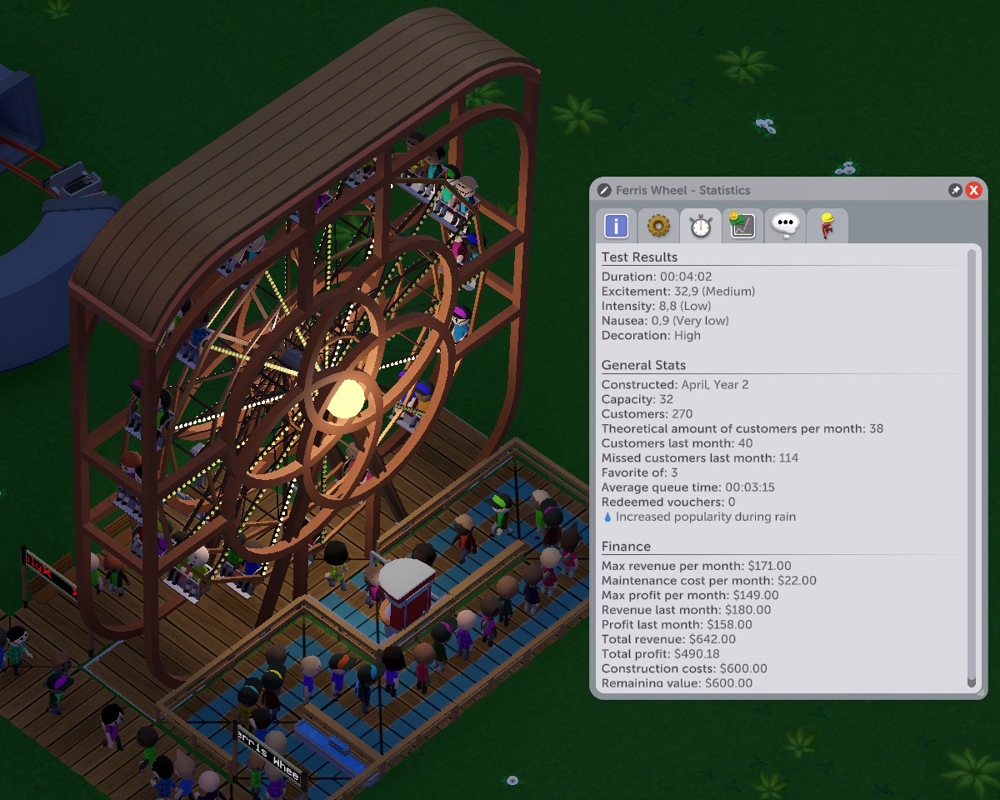

Per-ride notes

## Ferris Wheel
Ferris Wheel is great at keeping a large number of guests occupied for a while, and also almost comically slow at loading/unloading them.

It's so slow that, with Rounds set to 3 (default), you cannot have more than a few tiles of the queue because guests will get bored and leave *and* it will not turn a profit unless you place entrance/exit right in front of the middle tile of the ride.

With 1 round, rain protection, and some decoration the Ferris Wheel will eventually pay for itself, but is that why you're building these?  

## Double Ferris Wheel
Oh good, *two of them*.

This one's even slower at loading/unloading guests!

## Observation Tower
Functionally similar to the Ferris Wheel, but better at loading-unloading guests (especially if you place entrance/exit right in front of the door).

Higher towers are slightly more exciting, but also take longer.

## Motion Simulator
Not a very exciting ride, but you can fit it in a 3x3 area, and what else can do that

## Teacups
It's like some of the more intense nausea rides, but without the high excitement rating that usually comes with them. Consider doing something else instead.

## Spiral Slide
Both comically inefficient (one guest at a time!) and hard to properly decorate, this sure is a ride

## Scenic rides
Provided that you haven't been building your rides too close to each other, you can later add a Car Ride or Gentle Monorail Ride that twists around other attractions.

Not very effective, but surely amusing.

## Bumper cars
When set to Football mode and properly decorated, this is *the* most profitable flat calm ride.
