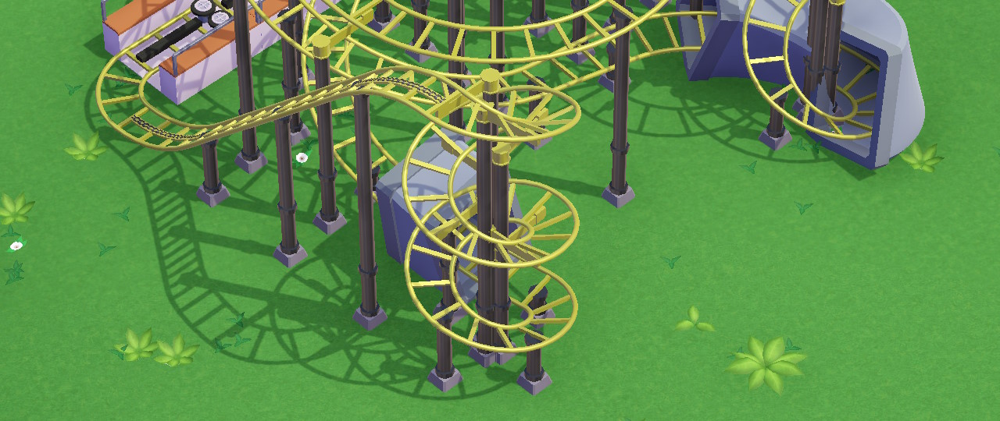

## Mini Coaster
Featured earlier in this guide, the Mini Coaster is a good, cheap low-intensity ride.

## Junior Coaster
Slightly more capable and expensive than a Mini Coaster, this one can be pushed to intensity of 50 or so.

## Powered Coaster
Fairly unique in that it has lap count, which allows for some elegant designs.

## Steel Coaster and co
Cool-looking and generally expensive to build.

In campaign, the game will periodically tempt you with these in missions where there's not enough starting money to build both a Cool Coaster and the rest of the park.

## Wild Mouse
Thanks to its ability to do sharp sloped turns, a Wild Mouse can possess *any* intensity rating - all while being not too nauseating *and* being much cheaper than big coasters that it can imitate.

*A signature "corkscrew" element on a Wild Mouse (front)*

We have occasionally built Wild Mice styled after one or other Big Coaster while giving these matching colors and names like "Steel Impcoaster". Good fun.

## Bobsled Coaster
As once finely coined by someone, make sure to always do a test run of your coaster with dummies, lest your Bobsled Coaster becomes a Bobslay Coaster.