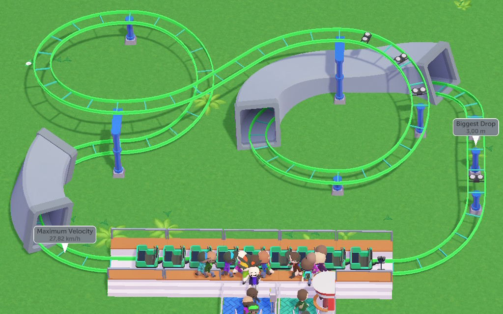

Outside of sandbox, you have a couple things to think about.

## First steps
If you're going for the "complete non-optional objectives by X" golden goal, you might spare yourself some pressure by pausing after starting the scenario.

Take a look around, set some foundations, check what buildings you get to play with this time.

A full list of things to consider (to avoid forgetting about them later) would be around:

- Some shops, benches, and a couple trash cans.
- A toilet.
- One of each employee type and a Staff Room.
- An Info Kiosk and/or a Cash Machine, if available.
- Change Research target if more thrill rides aren't what you want.
- 1+ ride of each intensity group (low/medium/high) so that there's something for everyone.

## Research
Researching a category unlocks a random building from it.

Each scenario has its own set of buildings that can be unlocked in each category, so you may not always get what you want.

## Finances
Since both optimal ride attendance fee and added maximum guest count are linked to rides' Excitement ratings, it all comes down to building more rides that the game considers cool.

As mentioned earlier, tracked rides are much better at this than flat rides.

For example, very few flat rides (mostly drop towers and expensive spinning rides) can have Excitement of >50. But you know what else has excitement of 50? This Mini Coaster:  

You don't have to build The Greatest Coaster Of All Times right away, small coasters like Log Flume or Mini Coaster can work just fine, and will help you grow an income to build bigger and more ambitious contraptions as time goes on.

## Loans
If there's not a "no loan debts" condition and you're running short on time for non-optional goals, you can totally take a loan.

More broadly, all scenarios can be completed without taking loans, but taking a loan to build a good coaster can pay off.

## Goals

What the game might want from you and what you can do with that:

- **Guest count**  
  See "Maximum guest count" in the "Park metrics" section
- **Ticket count**  
  Each time a new guest enters your park, that's a ticket.  
  It's easier to treat the two as the same instead of waiting for guests to get out of the park.
- **Happiness rating**  
  Check ratings in Park Info (on the left) and guest overlays in Visualizers to figure out what you need to work on.
- **Experiences rating**  
  See the "Park metrics" section.
- **Cleanliness rating**  
  If the park starts with a bunch of broken path attachments and garbage around it, it'll be easier to erase those paths and build them anew.
- **Overall rating**  
  A combination of all other ratings - generally keep guest metrics in a good shape.
- **Operating profit**  
  See "Finances" section above
- **Coasters with excitement rating of X**  
  See "Tracked rides" section for tips; for purposes of this goal, Log Flume is a coaster.

## Restrictions

In a good tradition, many of the campaign scenarios include one or other gimmick. Here are some of the more unusual ones and how you can approach them:

- **No ride fees**  
  If you can't charge for the rides, you can charge a much higher entrance fee.  
  Figuring out the price requires a little micro-management (keep increasing the fee bit by bit while no one's complaining about it being too high) and then you can bump it a little more whenever you add another ride to the park.  
  The key here is momentum - so long as you keep building more (and varied) rides, you'll keep getting more visitors, all while admission fee grows ever-larger.
- **No loan debts**  
  This doesn't mean that you can't take loans, just that you'll have to pay them off to win.
- **(limited land)**  
  A great excuse to practice fitting coasters into small spaces, but also: have you noticed that you can have coaster tracks go over other coasters and tracks?
- **No building above set height**  
  Don't forget that coasters can also dip underground if that's what you need for a good drop!
- **No building while paused**  
  This means that you _can_ pause so long as you unpause before placing something down (holding the thing is okay, unpause before clicking).  
  In multiplayer you can split responsibilities (someone builds shops, someone builds tracked rides) and be fine.
- **No tracked ride blueprints**  
  If you absolutely need to replicate your masterpiece in one of these scenarios, you can make a blueprint that has everything *except* for the ride itself - perhaps even some floating objects to serve as a guideline for where the track has to go.