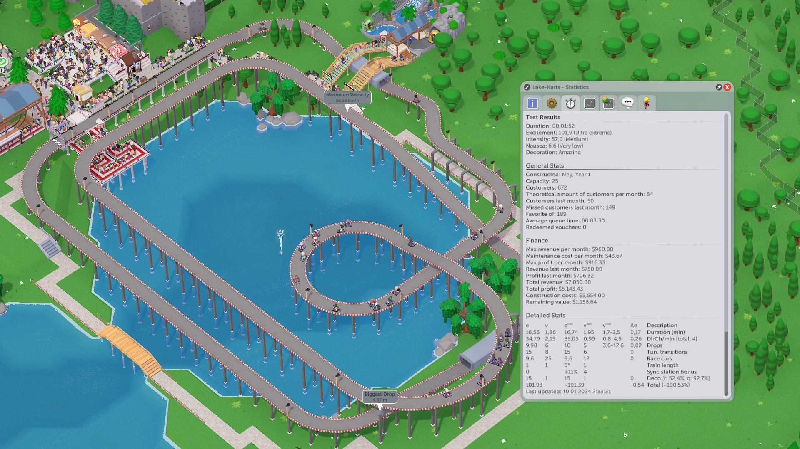
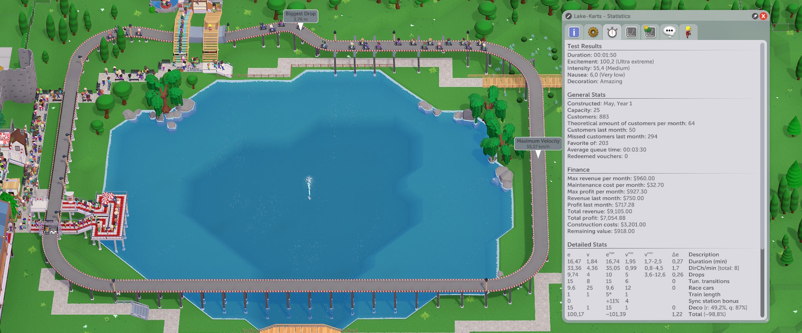
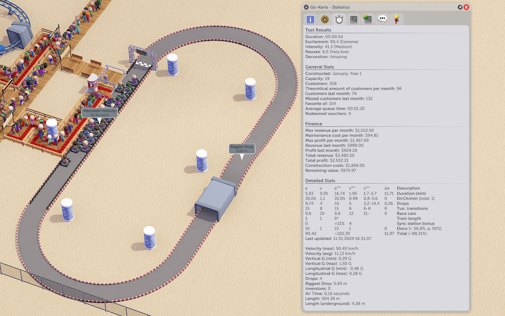
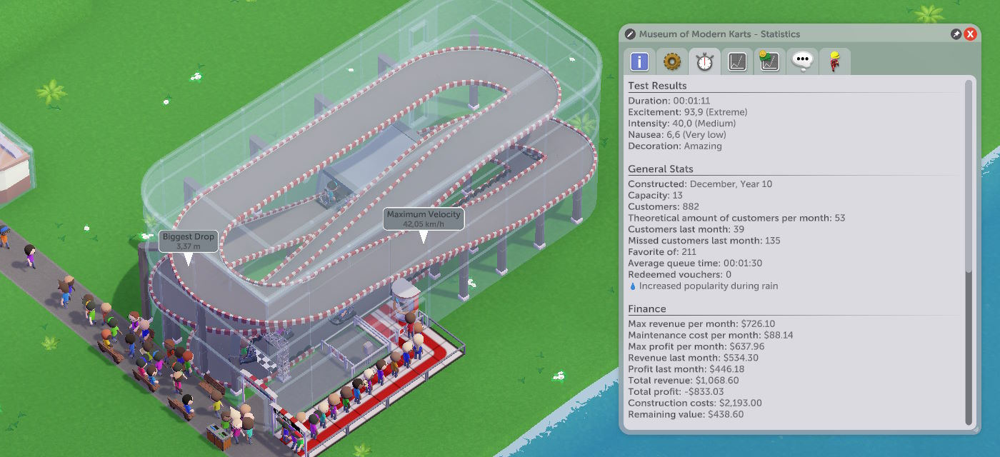
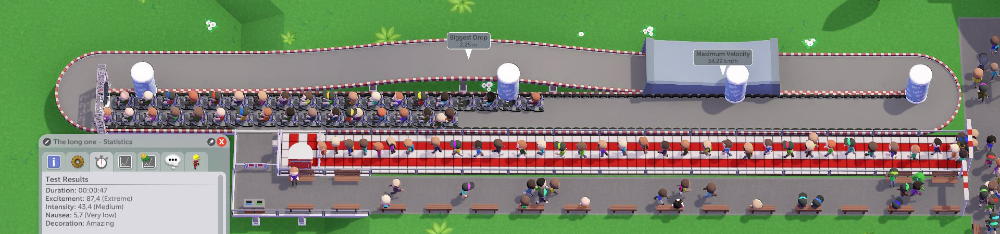

# The math behind Go-Karts
With maximum excitement slightly over 100,
Go-Karts are one of the more "exciting" rides in Parkitect,
but the metrics aren't widely documented or understood.

I hope to address that in this mini-guide.

## Metrics

The game's expectations are as following (as seen by [my mod](https://github.com/YAL-Game-Things/Parkitect-Advanced-Tracked-Ride-Stats)):

Legend:
- eMax: maximum excitement contribution
- vLow: lowest value that still gets 95% of max contribution
- vBest: optimal value (for 100% of max contribution)
- vHigh: highest value that still gets 95% of max contribution

| Metric | eMax | vLow | vBest | vHigh |
| --- | --- | --- | --- | --- |
| Duration | 16.74 | 100s | 117s | 150s |
| Dir changes | 35.05 | 0.8/min | 1/min | 4.5/min |
| Drops | 10 | 4 | 5 | 12 |
| Tunnels | 15 | 3 | 3 or 4 | 4
| Decoration | 15 | 57% | ≥60% | -
| Train length | 1 | | | |
| Car count | 9.6 |   | ≥12 | 
| Total | ~102.4

This doesn't include the sync station bonus, which grants up to 11% extra excitement (pre-decoration) if you have 4 synced up.

## Interpretation

A ride successfully incorporating these might look like the following
(with Victoria Lake for scale):  
  
At two 60-second laps with 3 drops, 2 tunnels, and 1 S-bend each, it is only half a point short of the presumed maximum score, but also that's a lot of track!

A little excitement can be sacrificed to make it easier to fit in an average park:
  
The track now features four 30-second laps with 1 drop, 1 tunnel, and 1 S-bend each, which moves it to the outer range of the "direction changes per minute" bonus, but reduces the cost by almost a half.

It might seem like the smallest as far as exciting tracks go - should you add more laps, you'll have too many direction changes per minute, and you can't have less than two direction changes per lap. But not quite:

## Cool Tricks

Due to [implementation details](https://github.com/YAL-Game-Things/Parkitect-Advanced-Tracked-Ride-Stats#direction-changes-per-minute),
a track that always turns left has 0 direction changes,
and a track that always turns right has 1 direction change.

And thus: a 40..60s track that always turns clockwise/right will hit the sweet spot of 1..2 direction changes per minute.

It will not get much or any bonus for duration, but losing 1/6 of the excitement rating to make your track two times shorter (read: more visitors per month) and almost two times cheaper is an easy sacrifice to make.

So here's a formula for A Good Go-Karts Track:
- 12+ cars (7+ station tiles)
- 4 laps
- 10-15s per lap
- Right turns only
- 1 drop per lap
- 1 tunnel per lap
- Well-decorated

For example, here's a pretty normal track:  
  
Perhaps too normal? But still, that's 85..90 excitement.

Here's a small one:  
  
It's roughly the same length, but folded.

And here's a silly one - a 20x2 track!  
  
Kind of upsetting, isn't it?